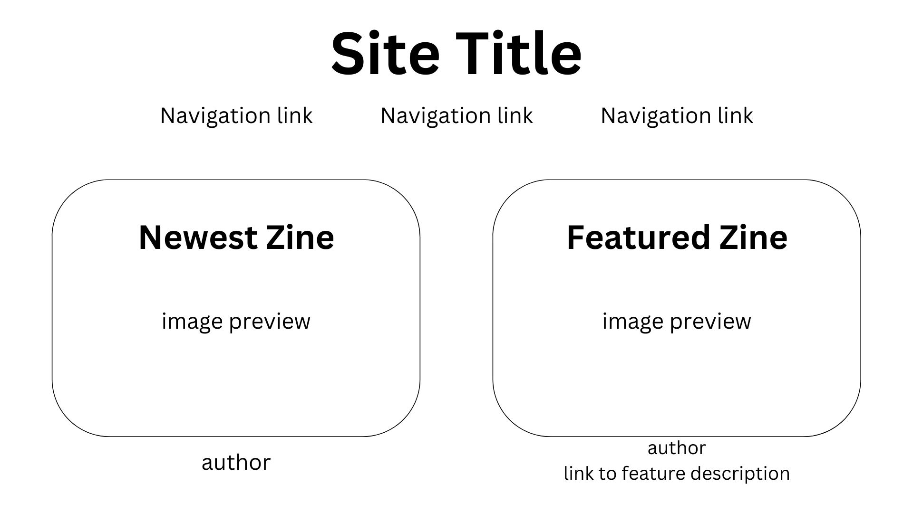
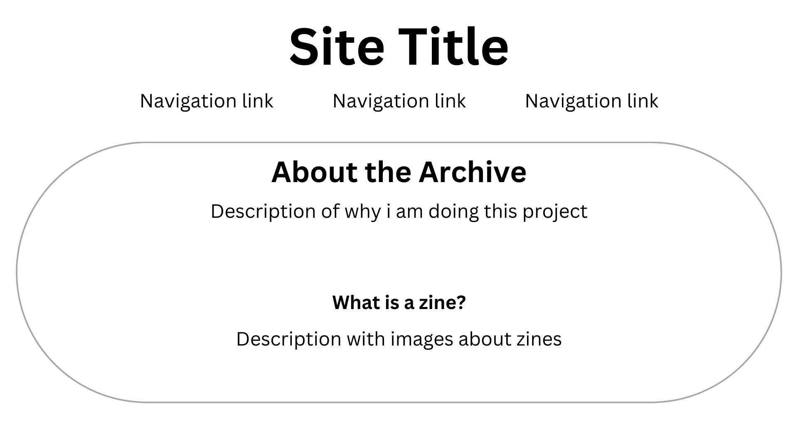
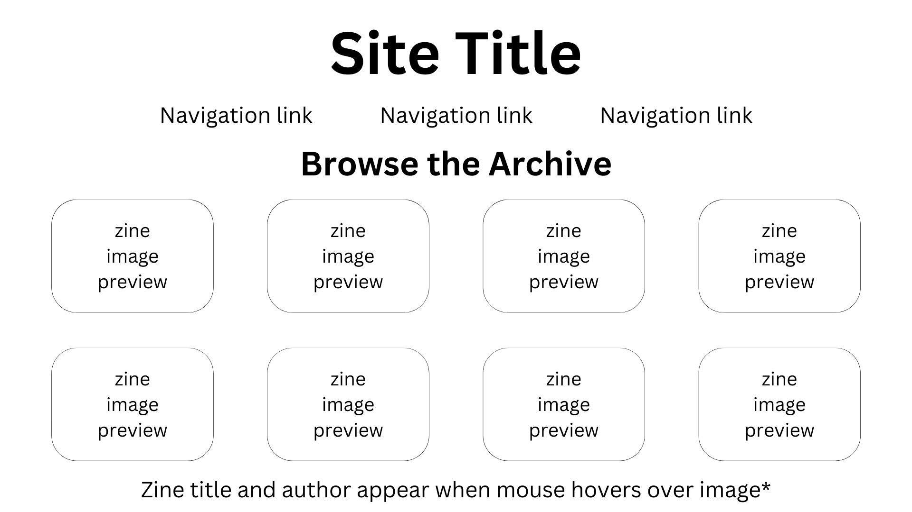

# Jaimie's INF 6420 Zine Library

A webarchive of zines I currently find relevant to my life, including zines made by friends, zines about things I'm learning at Wayne, and zines about textile crafts.  Additionally, this project will contain zine-making instructions and resources for people new to zine making.  

Header - contains title of archive

Navigation bar - will contain 'about me','open zine archive', and 'contact me' page

Main content - will contain two columns.  left column will display the most recently added zine.  right column will display a featured zine with a link to a short description written about this zine

Header - contains title of archive

Navigation bar - will contain 'about me','open zine archive', and 'contact me' page

Subheader ### H3 - About me title

Main content - the main content will include a description about me and my methods in curating and finding zines for this archive site.  Additionally, i may include some information about copyright and creative commons here about the use and distribution of these zines
I will also include a section titled 'what are zines' with information about the creation of zines, their historical uses, and a tutorial on zine creation.  Potentially could include a youtube video player with a playlist of zine-focused content creators.

Header - contains title of archive

Navigation bar - will contain 'about me','open zine archive', and 'contact me' page

Subheader ### H3 - browse the archive

Main content - this will include an 8 rectangle layout of zine in the collection.  each rectangle will have an image preview of the zine.  when you hover over the zine pages, the rectangle will darken and display the zine's title and the zine's author name.  

# other ideas

Other potential ideas include a page where people can find zines by theme